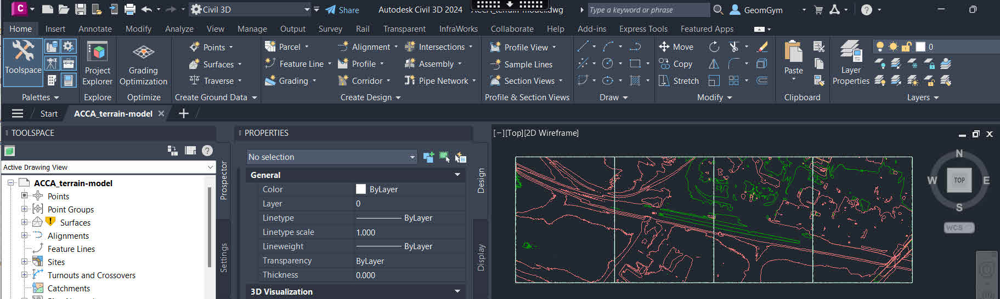
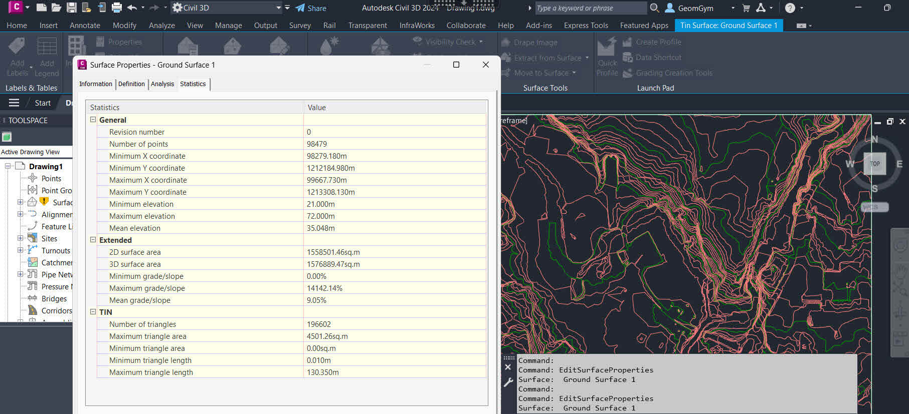
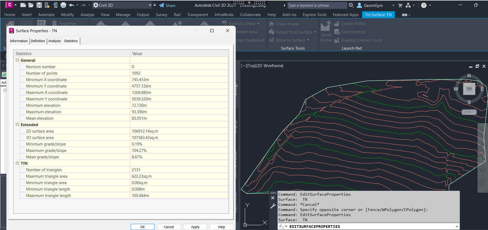
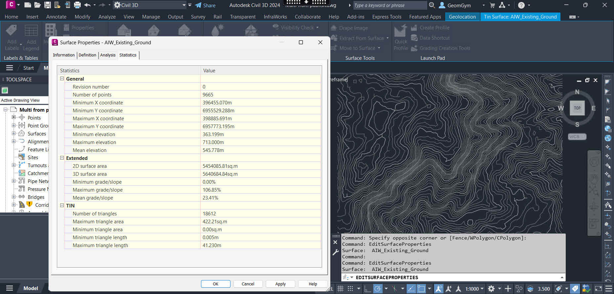

## Note
This folder contains example IFC files, used by the Implementers Forum to deal with the topic of Digital Terrain Modelling (DTM).
> NOTE  If not explicitly stated, these files shall be considered as draft, yet to be validated.
> None of the authors, in any way whatsoever, can be responsible for the use of the information contained in these files.

## Naming convention
Start the file name by identifying the vendor authoring it.

> EXAMPLE `Contoso_terrain-model.ifc`, `Acme_terrain-breps.ifc`

## Files

### [ACCA_terrain-model.ifc](./ACCA/ACCA_terrain-model.ifc.zip)

#### Validation Data

| Validation data                        |      Exporting tool       | Dassault  |   Esri    |        Sogelink                   |  Trimble  |  Bentley  | Infotech  |            Adtollo             | Civil 3D                          |
|----------------------------------------|:-------------------------:|:---------:|:---------:|:---------------------------------:|:---------:|:---------:|:---------:|:------------------------------:|:---------------------------------:|
| Screenshot(s)                          |         [01](#01)         | [02](#02) | [03](#03) |        [04](#04)                  | [05](#05) | [06](#06) | [07](#07) |           [08](#08)            | [09](#09)                         |
| Total area of the terrain surface (m2) |                           |           |           |                                   |           |           |           |           249250 m2            | 249251 m2  [^1]                   |
| Total number of triangles              |          927866           |           |           |          927848                   |           |           |           |             927848             | 927848     [^1]                   |
| Bounding box dimensions LxWxH (m)      |   [1892.5, 9.81, 530.5]   |           |           |      879.5 x 279.5 x 9.8          |           |           |           |       279.5, 879.5, 9.81       |                                   |
| Origin point of the bounding box       | (112.75, -2.18, -2100.25) |           |           | (2689112.75, 1254738.7500, 454.32)|           |           |           | 1254738.75, 2689112.75, 447.82 | 2689112.750, 1254738.750, 449.290 |                      

#### Screenshots

##### 01
[Link to model](https://service.usbim.com/link/651eae349242a358bea4321b)

##### 02
...

##### 03
...

##### 04

##### 05
...

##### 06
...

##### 07
...

##### 08

##### 09

### [Trimble_terrain-model.ifc](./TrimbleQuadri/Trimble_terrain-model.ifc)

#### Validation Data

| Validation data                        | Exporting tool | Dassault  |   Esri    |           Sogelink         |            Acca             |  Bentley  | Infotech  |         Adtollo          | Civil 3D                       |
|----------------------------------------|:--------------:|:---------:|:---------:|:--------------------------:|:---------------------------:|:---------:|:---------:|:------------------------:|:------------------------------:|
| Screenshot(s)                          |   [10](#10)    | [11](#11) | [12](#12) |             [13](#13)      |          [14](#14)          | [15](#15) | [16](#16) |        [17](#17)         | [18](#18)                      |
| Total area of the terrain surface (m2) |  1,578,901 m2  |           |           |            1578901.8       |                             |           |           |      1,578,901.9 m2      | 1576889.47  m2  [^1]           |
| Total number of triangles              |     196614     |           |           |            196614          |           196614            |           |           |          196614          | 196602  [^1]                   |
| Bounding box dimensions LxWxH (m)      |   343 points   |           |           |   1388.5 x 1123.1 x 51     |   [1388.55, 51, 1123.15]    |           |           |   1123.15, 1388.55, 51   | 1388.55, 1123.15, 51           |
| Origin point of the bounding box       |                |           |           | (98279.18, 1212184.98, 21) | (98279.2, 21, -1.21331e+06) |           |           | 1212184.98, 98279.18, 21 | 98279.180, 1212184.980, 21.000 | 

#### Screenshots

##### 10

##### 11
...

##### 12
...

##### 13

##### 14
[Link to model](https://service.usbim.com/link/651eb1cb9242a35443a43288)

##### 15
...

##### 16
...

##### 17

##### 18

### [Sogelink](./Sogelink)

#### Validation Data

| Validation data                        |      Exporting tool    | Dassault  |   Esri    |    ACCA   |  Trimble  |  Bentley  | Infotech  |  Adtollo  |  Civil 3D                |
|----------------------------------------|:----------------------:|:---------:|:---------:|:---------:|:---------:|:---------:|:---------:|:---------:|:------------------------:|
| Screenshot(s)                          |      [19](#19)         | [20](#20) | [21](#21) | [22](#22) | [23](#23) | [24](#24) | [25](#25) | [26](#26) | [27](#27)                |
| Total area of the terrain surface (m2) |      107916.8 m2       |           |           |           |           |           |           |           | 107583.42  [^1]          |
| Total number of triangles              |         2112           |           |           |           |           |           |           |           | 2131  [^1]               |
| (x,y,z) mini                           | ( 745.4, 4757.1, 72.7) |           |           |           |           |           |           |           | 745.453, 4757.126, 72.73 |
| (x,y,z) maxi                           | (1269.8, 5039.3, 93.4) |           |           |           |           |           |           |           | 1269.88, 5039.32, 93.39  |

#### Screenshots

##### 19

##### 20
...

##### 21
...

##### 22
...

##### 23
...

##### 24
...

##### 25
...

##### 26
...

##### 27

### [Autodesk Civil 3D](./AutodeskCivil3D)

#### Validation Data

| Validation data                        |      Exporting tool                | Dassault  |   Esri    | Sogelink  |    ACCA   |  Trimble  |  Bentley  | Infotech  |  Adtollo  | 
|----------------------------------------|:----------------------------------:|:---------:|:---------:|:---------:|:---------:|:---------:|:---------:|:---------:|:---------:|
| Screenshot(s)                          |      [28](#28)                     | [29](#29) | [30](#30) | [31](#31) | [32](#32) | [33](#33) | [34](#34) | [35](#35) | [36](#36) |
| Total area of the terrain surface (m2) |      5640684 m2                    |           |           |           |           |           |           |           |           |
| Total number of triangles              |         18612                      |           |           |           |           |           |           |           |           |
| (x,y,z) mini                           | (396455.070, 6955529.288, 363.199) |           |           |           |           |           |           |           |           |
| (x,y,z) maxi                           | (398885.691, 6957773.195, 713.000) |           |           |           |           |           |           |           |           |

#### Screenshots

##### 28

##### 28
...

##### 29
...
 
##### 30
...

##### 31
...

##### 32
...

##### 33
...

##### 34
...

##### 35
...

##### 36
...

[^1]: Civil 3D IFC import converts IFC TIN Surfaces into native Civil 3D Surface which recomputes triangulation from defining Coordinates.  Resultant attributes such as face count or area might have subtle variations as a result. 